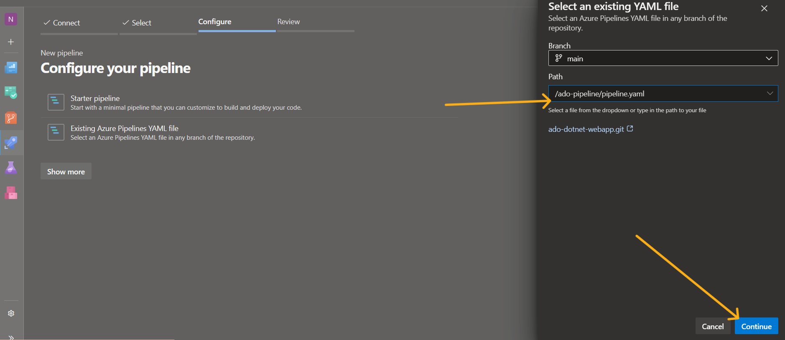
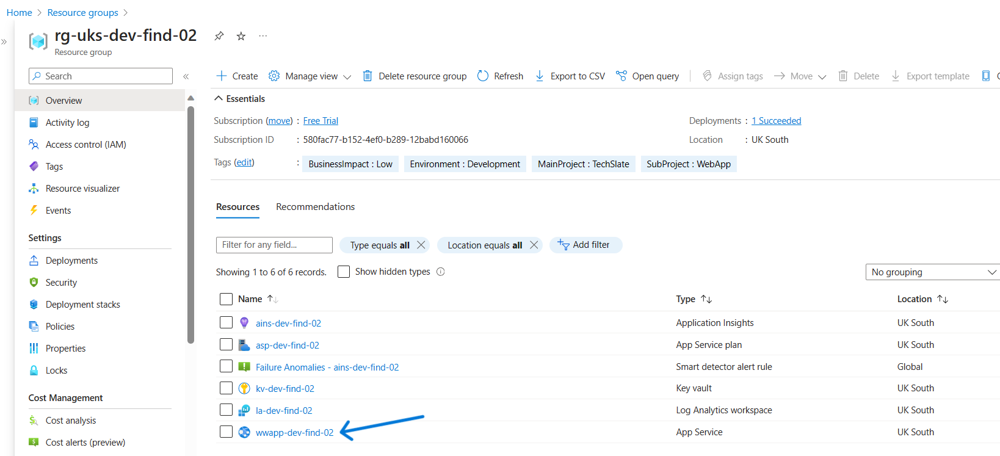

# **Executing an CI/CD Pipeline for running a Dotnet web Application using Azure DevOps.**

# Introduction

- **What is ``CI/CD Pipeline``** ?

    A continuous integration and continuous deployment (CI/CD) pipeline is a series of steps that must be performed in order to deliver a new version of software. CI/CD pipelines are a practice focused on improving software delivery throughout the software development life cycle via automation. 

    By automating CI/CD throughout development, testing, production, and monitoring phases of the software development lifecycle, organizations are able to develop higher quality code, faster and more securely. Although it’s possible to manually execute each of the steps of a CI/CD pipeline, the true value of CI/CD pipelines is realized through automation.

- This project contains few terraform resources ( for ex: ``resource group``, ``key_vault``, ``app_service_plan``, ``linux_web_app``, ``application_insights``, ``analytics_workspace``, ``key_vault_secret`` )
- There is ADO pipeline written ( use Azure DevOps to run Pipeline)
- Make sure to follow pre-requisites to create stroage account and service principal

# Pre-requisites
 - **Create Service Prinicipal.**
 - **Add all the details to 'common' group varialbe in ADO.**
 - **Give contributor access to Service Principal.**
 - **Create a storage account, since we store terraform statefile into storage account.**
 - **Storage account details, store them into ``COMMON`` group variable.**

  

 * ARM_CLIENT_ID
 * ARM_CLIENT_SECRET
 * ARM_TENANT_ID
 * ARM_SUBSCRIPTION_ID
 * az_sc_name
 * tf_state_rg_name
 * tf_state_st_acc_name
 * tf_state_st_cont_name
 * tf_state_subscription_id
 * tf_state_tenant_id

- **If you see above , we have added another varaible for ``Service Connection`` . i.e, ``az_sc_name``**
- **To create ``Service connection`` , we have to go back to Azure DevOps and Click on ``Project setting`` , and select ``Service Connections`` .**

- **Click on  ``New Service Connection`` .**

- **Select ``Azure Resource Manager`` .**

- **Select ``Azure Resource Manager`` .**

- **Fill in the text boxes with the respective ``Subscription-Id`` , ``Client-Id`` , ``Tenant-Id`` and ``Client-Secret`` .**

- **Click on  ``Verify and Save`` .**

- **The ``Service-Connection`` got created Successfully . Add the same name under the Common variables as shown above.**

# Folder Structure
- Modules - which contains modules of terraform
- Pipeline - this folder contains pipeline
- Terraform - this folder contains actual terraform project files ( main.tf, var.tf, provider.tf, backend.tf)

# Pipeline
- Pipeline contains 4 steps, terraform init, validte, plan, apply 
- Make sure to set env variables ( including terraform backend variables) - pls see pre-requisites for more info.

# Process

### 1. **First step to begin with , Open your VS CODE and do ``clone`` the repository .**

 

### 2. **Refer to the script properly and understand the process and steps.**

  

### 3. **Now come back to https://dev.azure.com/ (Azure DevOps) and Import your repository here.**

    

### 4. Repository imported successfully , now lets just check whether mentioned group variables in the pipeline are created in Azure DevOps Library or not .

### 5. Let's go back to the ``Library`` and confirm the presence of group varaibles i.e, ``Common`` and ``env-dev``. Make sure that below , Resource Group , Storage Account and Container are created in portal and names as it is .

- tf_state_rg_name
- tf_state_st_acc_name
- tf_state_st_cont_name

### 6. Now let's run the pipeline , Click on ``New Pipeline`` .

### 7. Select  ``Azure Repos Gits`` .

### 8. Select the Repository .

### 9. Click on ``Existing Azure Pipelines YAML file`` .

### 10. Select the Pipeline Path , and Lets first run the Infra Pipeline path & Click on ``Continue`` .

### 11.  Click on ``RUN`` .

### 12. The pipeline has started to Run , Lets wait for sometime .

### 13. So, when the pipeline got initialised it will ask you to permit to access the Group Variables , you need to click on ``Permit`` for both the Group Variables .

### 14. The Pipeline has run Sucessfully.

### 15. Now, Lets get back to the Azure Portal and see if our resources got created successfully and running. 

### 16. So , as we are done with running ``infra pipeline`` and infrastructure got created , now lets proceed and CI/CD pipeline ``Pipeline.yaml``

### 17. Click on ``New pipeline`` .

### 18. Select  ``Azure Repos Gits`` .

### 19. Select the Repository .

### 20. Click on ``Existing Azure Pipelines YAML file`` .

### 21. Select the Pipeline Path , Now Lets first run the CI/CD Pipeline path & Click on ``Continue`` .

### 22.  Click on ``RUN`` .

### 23. The pipeline has started to Run , Lets wait for sometime .

### 24. So, when the pipeline got initialised it will ask you to permit to access the Group Variables , you need to click on ``Permit`` for both the Group Variables . 

### 25. The CI/CD Pipeline has run Sucessfully.

### 26. Let's go back to the ``Azure Portal`` and Access our ``WebApp``.

### 27. Click on the ``Default Domain``.

### 27. The .Net web Application is running successfully.

